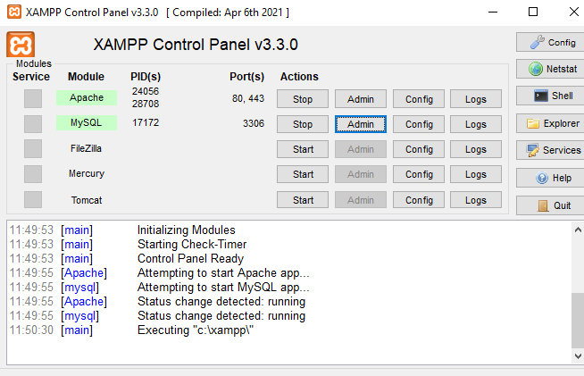

ShooterXGames

To run website you need to have Xampp installed

Link to xampp: [text](https://www.apachefriends.org/download.html)

When xampp control panel is installed you need to click start on Apache and mySQL

Go to explorer in xampp control panel and then when in file explorer click on the folder called htdocs

Clone the repository onto the desktop

Once in htdocs drag the cloned repository into this folder

Click on admin in xampp control panel for beside Apache

Click on ShooterXgames in the file directory on the browser

Instructions to install Database for ShooterXgames

In the xampp control panel click admin beside mySQL

Once in browser click on import on the top navbar

On the desktop make a text file and copy and paste the script I have provided below

-- phpMyAdmin SQL Dump
-- version 5.2.1
-- https://www.phpmyadmin.net/
--
-- Host: 127.0.0.1
-- Generation Time: Mar 02, 2024 at 12:57 PM
-- Server version: 10.4.28-MariaDB
-- PHP Version: 8.0.28

SET SQL_MODE = "NO_AUTO_VALUE_ON_ZERO";
START TRANSACTION;
SET time_zone = "+00:00";

/*!40101 SET @OLD_CHARACTER_SET_CLIENT=@@CHARACTER_SET_CLIENT */;
/*!40101 SET @OLD_CHARACTER_SET_RESULTS=@@CHARACTER_SET_RESULTS */;
/*!40101 SET @OLD_COLLATION_CONNECTION=@@COLLATION_CONNECTION */;
/*!40101 SET NAMES utf8mb4 */;

--
-- Database: `shooterxgames`
--

-- --------------------------------------------------------

--
-- Table structure for table `comments`
--

CREATE TABLE `comments` (
  `commentID` int(5) NOT NULL,
  `postID` int(5) NOT NULL,
  `userno` int(5) NOT NULL,
  `commentText` varchar(450) NOT NULL,
  `commentFlag` tinyint(1) NOT NULL,
  `commentFlagger` tinyint(1) NOT NULL
) ENGINE=InnoDB DEFAULT CHARSET=utf8mb4 COLLATE=utf8mb4_general_ci;

-- --------------------------------------------------------

--
-- Table structure for table `posts`
--

CREATE TABLE `posts` (
  `postID` int(5) NOT NULL,
  `category` text NOT NULL,
  `userno` int(5) NOT NULL,
  `title` varchar(45) NOT NULL,
  `postText` varchar(450) NOT NULL,
  `date_created` datetime NOT NULL DEFAULT current_timestamp(),
  `postFlag` tinyint(1) NOT NULL,
  `postFlagger` tinyint(1) NOT NULL
) ENGINE=InnoDB DEFAULT CHARSET=utf8mb4 COLLATE=utf8mb4_general_ci;

--
-- Dumping data for table `posts`
--

INSERT INTO `posts` (`postID`, `category`, `userno`, `title`, `postText`, `date_created`, `postFlag`, `postFlagger`) VALUES
(33, '', 0, '', '', '2023-06-11 21:42:42', 0, 0);

-- --------------------------------------------------------

--
-- Table structure for table `users`
--

CREATE TABLE `users` (
  `userno` int(5) NOT NULL,
  `firstname` text NOT NULL,
  `lastname` text NOT NULL,
  `email` varchar(65) NOT NULL,
  `username` varchar(45) NOT NULL,
  `password` varchar(128) NOT NULL,
  `isSuspended` tinyint(1) NOT NULL,
  `isAdmin` tinyint(1) NOT NULL
) ENGINE=InnoDB DEFAULT CHARSET=utf8mb4 COLLATE=utf8mb4_general_ci;

--
-- Dumping data for table `users`
--

INSERT INTO `users` (`userno`, `firstname`, `lastname`, `email`, `username`, `password`, `isSuspended`, `isAdmin`) VALUES
(2, 'luke', 'skywalker', 'luke@gmail.com', 'luke2', '$2y$10$eLIG5eZR8SPnHAys2luSkeUQGdQLtRfp6rleubIVmLbDdeUvo0HQ.', 0, 1),
(3, 'jack', 'wills', 'jackwills@gmail.com', 'jackwills', '$2y$10$Se.dnnd0tkIGnIKd.BrL8uAyekIZK3VXufIaegiOoRermmsMb6aRO', 0, 0),
(4, 'gary', 'small', 'gary@hotmail.com', 'gary2', '$2y$10$0Eagn5w7E4UcMYqaIQ57RuPwkOE0BQM4uZeNBtlV.zeaayuElC/Su', 0, 0);

--
-- Indexes for dumped tables
--

--
-- Indexes for table `comments`
--
ALTER TABLE `comments`
  ADD PRIMARY KEY (`commentID`);

--
-- Indexes for table `posts`
--
ALTER TABLE `posts`
  ADD PRIMARY KEY (`postID`);

--
-- Indexes for table `users`
--
ALTER TABLE `users`
  ADD PRIMARY KEY (`userno`);

--
-- AUTO_INCREMENT for dumped tables
--

--
-- AUTO_INCREMENT for table `comments`
--
ALTER TABLE `comments`
  MODIFY `commentID` int(5) NOT NULL AUTO_INCREMENT, AUTO_INCREMENT=4;

--
-- AUTO_INCREMENT for table `posts`
--
ALTER TABLE `posts`
  MODIFY `postID` int(5) NOT NULL AUTO_INCREMENT, AUTO_INCREMENT=34;

--
-- AUTO_INCREMENT for table `users`
--
ALTER TABLE `users`
  MODIFY `userno` int(5) NOT NULL AUTO_INCREMENT, AUTO_INCREMENT=5;
COMMIT;

/*!40101 SET CHARACTER_SET_CLIENT=@OLD_CHARACTER_SET_CLIENT */;
/*!40101 SET CHARACTER_SET_RESULTS=@OLD_CHARACTER_SET_RESULTS */;
/*!40101 SET COLLATION_CONNECTION=@OLD_COLLATION_CONNECTION */;

Save the script as shooterxgames.sql

Go back to browser and click on browse and select the sql script

The database is now installed

