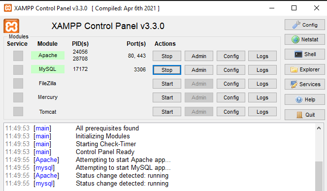
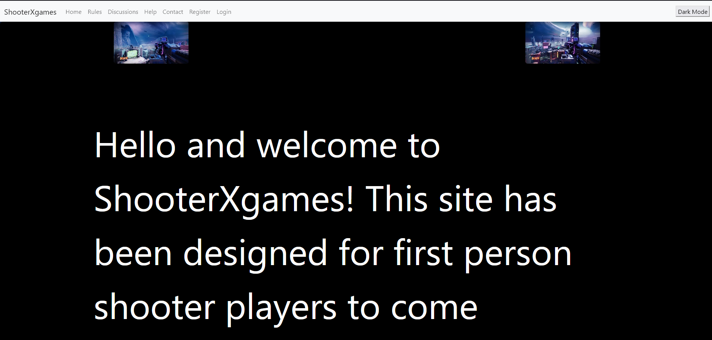

ShooterXGames

To run website you need to have Xampp installed

Link to xampp: [text](https://www.apachefriends.org/download.html)

When xampp control panel is installed you need to click start on Apache and mySQL

Go to explorer in xampp control panel and then when in file explorer click on the folder called htdocs

Clone the repository onto the desktop

Once in htdocs drag the cloned repository into this folder

Click on admin in xampp control panel for beside Apache

Click on ShooterXgames in the file directory on the browser

